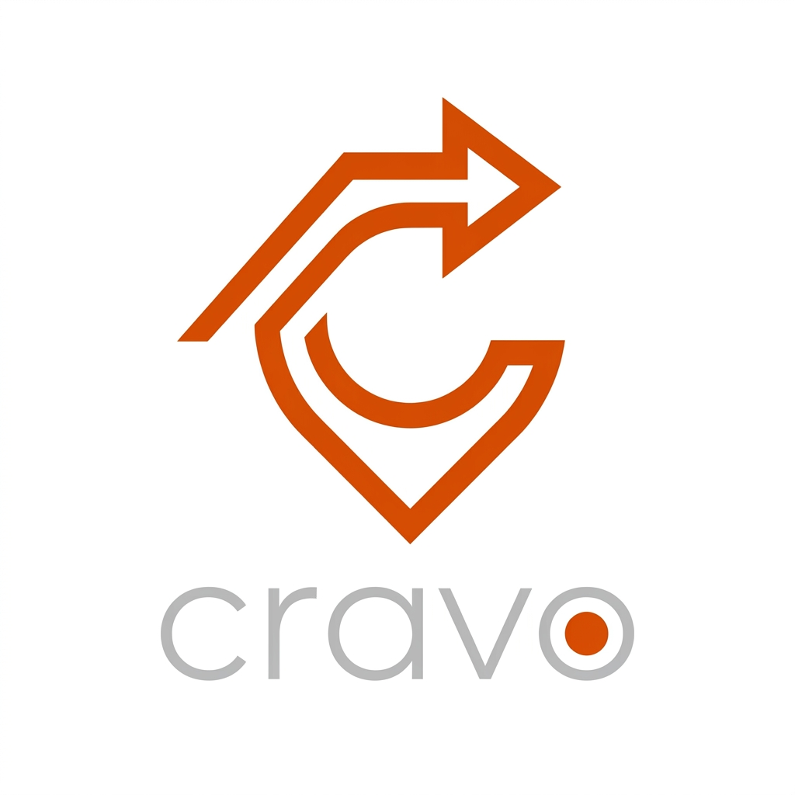
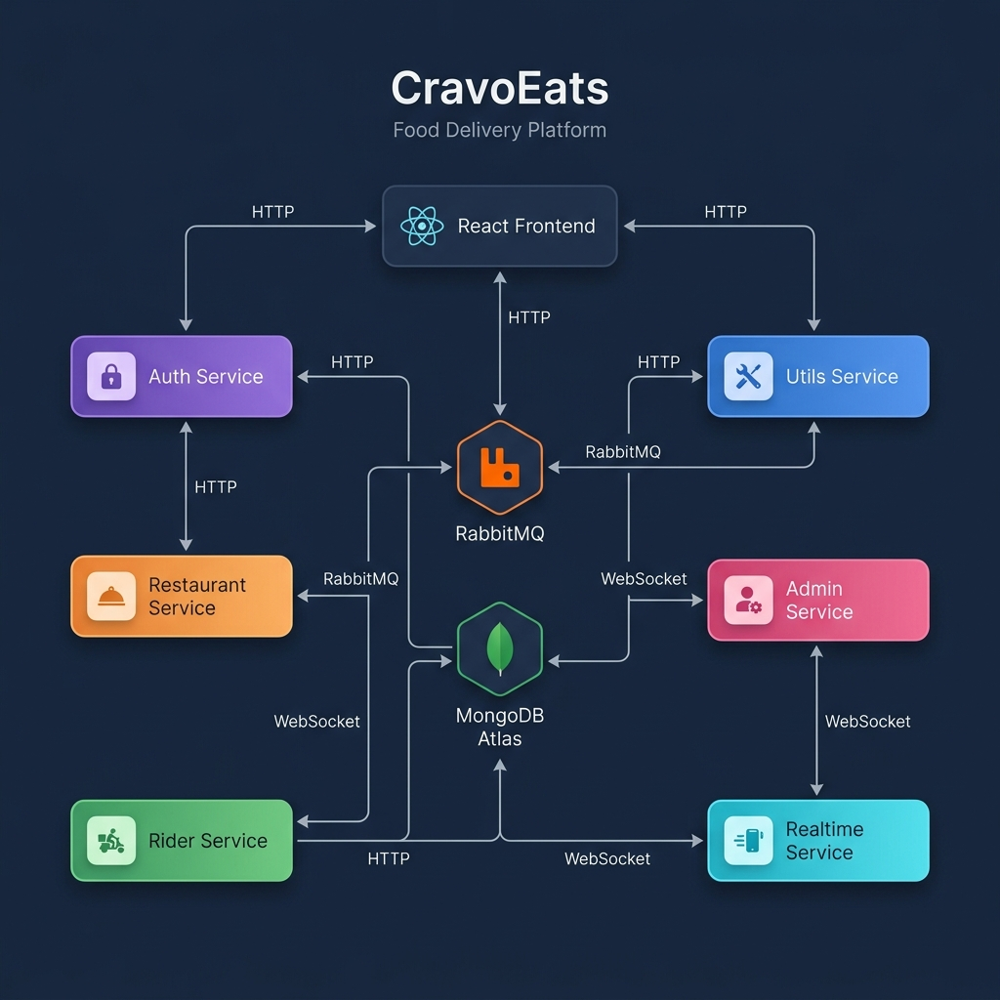

<p align="center">
  
</p>

<h1 align="center">CravoEats</h1>
<p align="center">
  A full-stack food delivery platform built on an event-driven microservices architecture
</p>

<p align="center">
  
  
  
  
  
  
  
  
</p>

---

## About

I built CravoEats as my final year B.Tech CSE project to understand how production food delivery systems actually work under the hood. Instead of the usual monolithic Express+React setup that most tutorial projects follow, I designed this around 6 independent backend services that communicate through both synchronous HTTP calls and asynchronous RabbitMQ message queues.

The platform covers the complete food delivery lifecycle — from browsing nearby restaurants and placing an order, through payment processing and real-time tracking, all the way to delivery confirmation. There are four distinct user roles (customer, restaurant owner, delivery rider, admin), each with their own dashboard and set of interactions.

> **Live Demo:** [https://cravo-eats.vercel.app](https://cravo-eats.vercel.app) *(coming soon)*
>
> **Note on deployment:** The live demo runs on a consolidated backend instance to avoid free-tier cold starts and API timeouts. This repository contains the actual microservices architecture designed for horizontal scalability in production.

---

## Features

### Customer Flow
- Sign in with **Google OAuth** — no passwords to manage
- Restaurants are automatically sorted by distance using MongoDB's `$geoNear` aggregation with 2dsphere indexes
- Add items to cart with quantity controls, view itemized price breakdown
- Pay using **Stripe Checkout** or **Razorpay** (dual gateway support)
- Track your order in real-time as it moves through `placed → accepted → preparing → ready → picked_up → delivered`
- View delivery route on an interactive **Leaflet** map with live rider location
- See order history with refund status badges
- Save multiple delivery addresses with reverse geocoding via Nominatim

### Restaurant Owner Flow
- Register your restaurant with image upload (Cloudinary), GPS coordinates, and cuisine tags
- Add/remove menu items with photos and pricing
- Toggle restaurant open/closed status
- Receive incoming orders in real-time via Socket.IO
- Progress order status with one click: accept → preparing → ready for pickup

### Delivery Rider Flow  
- Register with KYC documents (Aadhaar, license — uploaded to Cloudinary)
- Toggle online/offline and share live GPS location
- Automatically matched with nearby orders via geospatial queries
- Accept deliveries, confirm pickup, update delivery status

### Admin Flow
- Review pending restaurant registration requests
- Review pending rider KYC applications  
- Approve or reject with a single action

---

## System Architecture

The backend follows a **microservices pattern** — each service is an independent Express.js application with its own responsibility. They share a common MongoDB Atlas database (same cluster, same `Zomato_Clone` database) but are otherwise fully decoupled.

<p align="center">
  
</p>

```
┌─────────────────────────────────────────────────────────────────┐
│                      React + Vite Frontend                      │
│                     (Port 5173 · Vercel)                        │
└──────┬──────────┬──────────┬──────────┬──────────┬──────────┬───┘
       │          │          │          │          │          │
  ┌────▼───┐ ┌───▼────┐ ┌───▼───┐ ┌───▼────┐ ┌───▼───┐ ┌───▼───┐
  │  Auth  │ │ Rest-  │ │ Utils │ │Realtime│ │ Rider │ │ Admin │
  │ :5000  │ │ aurant │ │ :5002 │ │ :5004  │ │ :5005 │ │ :5006 │
  │        │ │ :5001  │ │       │ │        │ │       │ │       │
  └────────┘ └───┬────┘ └───┬───┘ └───┬────┘ └───┬───┘ └───────┘
                 │          │         │          │
                 ▼          ▼         ▼          ▼
           ┌──────────┐  ┌─────┐  ┌──────┐  ┌──────────┐
           │ MongoDB  │  │Stripe│  │Socket│  │ RabbitMQ │
           │  Atlas   │  │Rzpay │  │ .IO  │  │  Broker  │
           └──────────┘  └─────┘  └──────┘  └──────────┘
```

### Service Breakdown

| Service | Port | Responsibility |
|---------|------|----------------|
| **Auth** | 5000 | Google OAuth 2.0 login, JWT token generation, role assignment |
| **Restaurant** | 5001 | Restaurant CRUD, menu items, cart, orders, addresses, order lifecycle |
| **Utils** | 5002 | Cloudinary image uploads, Stripe/Razorpay payment processing |
| **Realtime** | 5004 | Socket.IO WebSocket server, room management, event broadcasting |
| **Rider** | 5005 | Rider registration, availability toggle, delivery management |
| **Admin** | 5006 | Platform admin — approve/reject restaurants and riders |

### How Services Communicate

**1. Synchronous HTTP (Axios)**  
Services call each other's internal endpoints using `axios` with a shared `x-internal-key` header. For example:
- Rider Service → Restaurant Service: Assign a rider to an order
- Restaurant Service → Utils Service: Upload images
- Restaurant/Rider Service → Realtime Service: Push socket events

**2. Asynchronous Messaging (RabbitMQ)**  
Two critical flows are decoupled via message queues:

```
Payment confirmed (Stripe/Razorpay)
  └─► Utils Service publishes to `payment_event` queue
        └─► Restaurant Service consumes → marks order as "paid"

Restaurant marks order "ready for pickup"  
  └─► Restaurant Service publishes to `order_ready_queue`
        └─► Rider Service consumes → finds nearest rider via $geoNear
              └─► Pushes notification via Realtime Service (Socket.IO)
```

**3. Real-time WebSockets (Socket.IO)**  
The Realtime Service acts as a centralized WebSocket hub. Other services emit events via an internal HTTP endpoint (`POST /api/v1/internal/emit`), and it broadcasts to specific rooms (`user:{id}`, `restaurant:{id}`). This keeps the other services stateless.

---

## Order Lifecycle

Every step emits a Socket.IO event so all connected dashboards (customer, restaurant, rider) update simultaneously without polling.

```
  Customer places order ──► Order created (status: "placed")
          │                           │
          │                   Payment gateway (Stripe/Razorpay)
          │                           │
          │                   Utils Service verifies payment
          │                           │
          │                   Publishes PAYMENT_SUCCESS ──► RabbitMQ
          │                           │
          │                   Restaurant Service consumes
          │                   └─► paymentStatus = "paid"
          │
          ▼
  Restaurant accepts ──────► status: "accepted"
          │
          ▼
  Restaurant prepares ─────► status: "preparing"  
          │
          ▼
  Restaurant marks ready ──► status: "ready_for_pickup"
          │                           │
          │                   Publishes ORDER_READY ──► RabbitMQ
          │                           │
          │                   Rider Service consumes
          │                   └─► Finds nearest online rider ($geoNear)
          │                   └─► Socket.IO notification to rider
          │
          ▼
  Rider accepts ───────────► status: "on_the_way" + riderId assigned
          │
          ▼
  Rider picks up ──────────► status: "picked_up"
          │
          ▼
  Rider delivers ──────────► status: "delivered" ✓
```

If the restaurant cancels the order, and payment was already collected, the system automatically sets `paymentStatus: "refunded"` and the customer sees a refund badge on their order history.

---

## Tech Stack

| Layer | Technology | Why I chose it |
|-------|-----------|----------------|
| **Frontend** | React 18, TypeScript, Vite | Vite's HMR makes development fast, TS catches bugs early |
| **UI Components** | shadcn/ui (Radix primitives), Tailwind CSS | Accessible, composable components without the bloat of full UI libraries |
| **Animations** | Framer Motion | Smooth page transitions and micro-interactions that make the UI feel polished |
| **State** | React Context + Zustand | Context for auth/socket, Zustand for lightweight client state |
| **Backend** | Node.js, Express 5, TypeScript | Each service is a standalone Express app with its own types |
| **Database** | MongoDB Atlas, Mongoose 9 | Flexible schemas + native geospatial indexing (`2dsphere`) for proximity queries |
| **Auth** | Google OAuth 2.0 + JWT | No password storage, stateless authentication |
| **Payments** | Stripe + Razorpay | Dual gateway — Stripe for international, Razorpay for India |
| **Messaging** | RabbitMQ (amqplib) | Decouples payment and rider-assignment flows between services |
| **Real-time** | Socket.IO | Bidirectional event streaming for order tracking |
| **Maps** | Leaflet + OpenStreetMap | Free alternative to Google Maps, no API key billing |
| **File Uploads** | Cloudinary | CDN-backed image hosting for restaurant/menu/rider photos |
| **Icons** | Lucide React | Clean, consistent icon set |
| **PWA** | vite-plugin-pwa + Workbox | Installable on mobile with offline caching |

---

## Project Structure

```
cravo-food-delivery/
│
├── frontend/                          # React SPA (Vite + TypeScript)
│   └── src/
│       ├── components/                # Navbar, OrderCard, MapView, ProtectedRoute
│       ├── context/                   # AppContext (auth), SocketContext, ThemeProvider
│       ├── features/                  # Feature modules (landing page sections)
│       ├── pages/                     # Route-level page components
│       │   ├── Home.tsx               # Restaurant listing with geo-sorting
│       │   ├── RestaurantPage.tsx     # Single restaurant menu + add to cart
│       │   ├── Cart.tsx               # Cart management + price breakdown  
│       │   ├── Checkout.tsx           # Address selection + payment gateway
│       │   ├── OrderPage.tsx          # Live order tracking with map
│       │   ├── Orders.tsx             # Order history with status badges
│       │   ├── Restaurant.tsx         # Restaurant owner dashboard
│       │   ├── RiderDashboard.tsx     # Rider order management
│       │   └── Admin.tsx              # Admin verification panel
│       ├── types.ts                   # Shared TypeScript interfaces (IUser, IOrder, etc.)
│       └── main.tsx                   # Entry point with providers
│
├── services/
│   ├── auth/                          # Authentication service
│   │   └── src/
│   │       ├── controllers/auth.ts    # Google OAuth exchange, JWT generation
│   │       ├── models/User.ts         # User schema (roles, location)
│   │       ├── middlewares/isAuth.ts   # JWT verification + role guards
│   │       └── config/googleConfig.ts # OAuth2 client setup
│   │
│   ├── restaurant/                    # Core business logic service  
│   │   └── src/
│   │       ├── controllers/
│   │       │   ├── restaurant.ts      # CRUD + $geoNear proximity queries
│   │       │   ├── menuitem.ts        # Menu item management
│   │       │   ├── cart.ts            # Cart add/remove/increment/decrement
│   │       │   ├── order.ts           # Full order lifecycle (25+ endpoints)
│   │       │   └── address.ts         # Saved delivery addresses
│   │       ├── models/                # Order, Cart, Restaurant, Address, MenuItem
│   │       └── config/
│   │           ├── rabbitmq.ts        # RabbitMQ connection + channel
│   │           └── payment.consumer.ts # Consumes PAYMENT_SUCCESS events
│   │
│   ├── rider/                         # Rider management service
│   │   └── src/
│   │       ├── controllers/rider.ts   # Register, toggle, accept, deliver
│   │       ├── models/Rider.ts        # 2dsphere geospatial index on location
│   │       └── config/
│   │           └── orderReady.consumer.ts  # Consumes ORDER_READY, finds nearest rider
│   │
│   ├── utils/                         # Utility/payment service
│   │   └── src/
│   │       ├── controllers/
│   │       │   ├── payment.ts         # Stripe Checkout + Razorpay order/verify
│   │       │   └── upload.ts          # Cloudinary upload handler
│   │       └── config/rabbitmq.ts     # Publishes PAYMENT_SUCCESS events
│   │
│   ├── realtime/                      # WebSocket hub
│   │   └── src/
│   │       ├── socket.ts             # Socket.IO server + JWT auth + room management
│   │       └── routes/internal.ts     # POST /emit — internal event broadcast endpoint
│   │
│   └── admin/                         # Admin verification service
│       └── src/
│           ├── controllers/admin.ts   # List pending, approve/reject
│           └── utils/collection.ts    # Cross-collection access helpers
│
├── assets/                            # README images
├── .gitignore
└── package.json                       # Root-level scripts (concurrent startup)
```

---

## Getting Started

### Prerequisites

- **Node.js** v18+
- **MongoDB Atlas** cluster ([free tier](https://www.mongodb.com/cloud/atlas) works)
- **RabbitMQ** — local install or [CloudAMQP](https://www.cloudamqp.com/) free instance
- **Google Cloud Console** — OAuth 2.0 credentials
- **Cloudinary** — [free account](https://cloudinary.com/)
- **Stripe** and/or **Razorpay** — test mode API keys

### Setup

```bash
# Clone
git clone https://github.com/your-username/cravo-food-delivery.git
cd cravo-food-delivery

# Install everything (root + frontend + all 6 services)
npm install

# Configure environment variables
# Each service has its own .env file — see the table below for what's needed
# services/auth/.env
# services/restaurant/.env  
# services/rider/.env
# services/realtime/.env
# services/utils/.env
# services/admin/.env
# frontend/.env

# Start all services + frontend concurrently
npm run dev
```

Open [http://localhost:5173](http://localhost:5173) in your browser.

### Environment Variables

| Variable | Services | Purpose |
|----------|----------|---------|
| `MONGO_URI` | Auth, Restaurant, Rider, Admin | MongoDB Atlas connection string |
| `JWT_SEC` | All backend services | JWT signing secret (same across all) |
| `GOOGLE_CLIENT_ID` | Auth, Frontend | Google OAuth app ID |
| `GOOGLE_CLIENT_SECRET` | Auth | Google OAuth secret |
| `RABBITMQ_URL` | Restaurant, Rider, Utils | RabbitMQ connection URL |
| `CLOUD_NAME`, `CLOUD_API_KEY`, `CLOUD_SECRET_KEY` | Utils | Cloudinary credentials |
| `STRIPE_SECRET_KEY` | Utils | Stripe secret key (test mode) |
| `RAZORPAY_KEY_ID`, `RAZORPAY_KEY_SECRET` | Utils | Razorpay credentials |
| `INTERNAL_SERVICE_KEY` | Restaurant, Rider, Utils, Realtime | Shared key for inter-service auth |
| `FRONTEND_URL` | Utils | Stripe/Razorpay redirect URL |

---

## Docker

Each service has its own multi-stage `Dockerfile`:
1. **Build stage** — installs all dependencies, compiles TypeScript
2. **Production stage** — copies only compiled JS + production deps

```bash
# Build any service
cd services/restaurant
docker build -t cravo-restaurant .

# Run it
docker run -p 5001:5001 --env-file .env cravo-restaurant
```

---

## API Endpoints

<details>
<summary><strong>Auth Service</strong> — <code>/api/auth</code></summary>

| Method | Endpoint | Description |
|--------|----------|-------------|
| POST | `/login` | Exchange Google OAuth code for JWT |
| PUT | `/add/role` | Assign role (customer/seller/rider) |
| GET | `/me` | Get authenticated user profile |

</details>

<details>
<summary><strong>Restaurant Service</strong> — <code>/api/restaurant</code>, <code>/api/item</code>, <code>/api/cart</code>, <code>/api/order</code>, <code>/api/address</code></summary>

| Method | Endpoint | Description |
|--------|----------|-------------|
| POST | `/api/restaurant/new` | Register restaurant |
| GET | `/api/restaurant/all` | Nearby restaurants (geo-sorted) |
| GET | `/api/restaurant/:id` | Restaurant details |
| PUT | `/api/restaurant/status` | Toggle open/closed |
| POST | `/api/item/new` | Add menu item |
| GET | `/api/item/all/:restaurantId` | Menu items |
| DELETE | `/api/item/:id` | Remove menu item |
| POST | `/api/cart/add` | Add to cart |
| GET | `/api/cart/all` | Get cart |
| PUT | `/api/cart/inc/:itemId` | Increment quantity |
| PUT | `/api/cart/dec/:itemId` | Decrement quantity |
| DELETE | `/api/cart/clear` | Clear cart |
| POST | `/api/order/new` | Place order |
| GET | `/api/order/myorder` | Order history |
| GET | `/api/order/:id` | Order details |
| PUT | `/api/order/:id` | Update status |
| POST | `/api/address/new` | Save address |
| GET | `/api/address/all` | Saved addresses |

</details>

<details>
<summary><strong>Utils Service</strong> — <code>/api/payment</code>, <code>/api/upload</code></summary>

| Method | Endpoint | Description |
|--------|----------|-------------|
| POST | `/api/payment/create` | Create Razorpay order |
| POST | `/api/payment/verify` | Verify Razorpay signature |
| POST | `/api/payment/stripe/create` | Create Stripe session |
| GET | `/api/payment/stripe/success` | Stripe callback |
| POST | `/api/upload` | Upload image to Cloudinary |

</details>

<details>
<summary><strong>Rider Service</strong> — <code>/api/rider</code></summary>

| Method | Endpoint | Description |
|--------|----------|-------------|
| POST | `/new` | Register rider |
| GET | `/myprofile` | Rider profile |
| PATCH | `/toggle` | Toggle availability + update GPS |
| PUT | `/accept/:orderId` | Accept delivery |
| PUT | `/status/:orderId` | Update delivery status |

</details>

<details>
<summary><strong>Admin Service</strong> — <code>/api/v1</code></summary>

| Method | Endpoint | Description |
|--------|----------|-------------|
| GET | `/admin/restaurant/pending` | Pending restaurants |
| GET | `/admin/rider/pending` | Pending riders |
| PATCH | `/verify/restaurant/:id` | Approve/reject restaurant |
| PATCH | `/verify/rider/:id` | Approve/reject rider |

</details>

---

## Design Decisions

**Why microservices?**  
I wanted to go beyond a typical MERN tutorial project. Decomposing the system into services forced me to think about inter-service communication patterns, data ownership boundaries, and failure handling — concepts that are fundamental in real-world backend engineering.

**Why RabbitMQ over just HTTP?**  
The rider-matching flow is a textbook async use case. When a restaurant marks an order ready, it shouldn't wait for the system to scan through riders and find the nearest one. It publishes an event and moves on. The Rider Service handles it asynchronously. Same logic applies to payment confirmation — the payment gateway webhook shouldn't be blocked by order status updates.

**Why a dedicated Realtime Service?**  
Adding Socket.IO to every service would mean managing WebSocket connections in 5 different processes. Instead, I centralized it into a single service that other services call via a simple internal HTTP POST. This keeps the other services stateless and easy to scale.

**Why Google OAuth only?**  
For a food delivery app, email/password auth adds complexity (password hashing, reset flows, email verification) without adding value. Social login is the industry standard for consumer-facing apps.

**Why Leaflet over Google Maps?**  
Google Maps API has aggressive per-request pricing. Leaflet + OpenStreetMap is free and open-source, which makes more sense for a project where I'm learning architecture, not paying cloud bills.

---

## What I Learned

Building this project taught me more than any course or tutorial:
- How to design service boundaries and decide what belongs where
- The difference between sync (HTTP) and async (message queue) communication and when each makes sense
- Managing distributed state — the same order is referenced by 3 different services
- WebSocket room management and how real-time features work at scale
- Payment gateway integration with proper webhook verification
- Geospatial indexing in MongoDB and how proximity-based queries actually work

---

## Future Scope

- [ ] Push notifications via Firebase Cloud Messaging
- [ ] Restaurant analytics — daily orders, revenue charts (Recharts is already installed)
- [ ] Rider earnings dashboard with payout history
- [ ] Rating and review system for restaurants
- [ ] Search autocomplete with MongoDB Atlas Search
- [ ] Global `docker-compose.yml` for one-command local setup
- [ ] CI/CD pipeline with GitHub Actions

---

## License

Built as a final year B.Tech CSE project. Open for reference and learning.

---

**Built by [Saket Mathur](https://github.com/saketmathur)** · 2025
